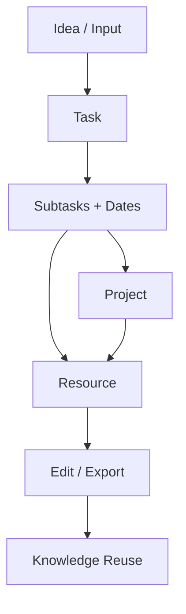
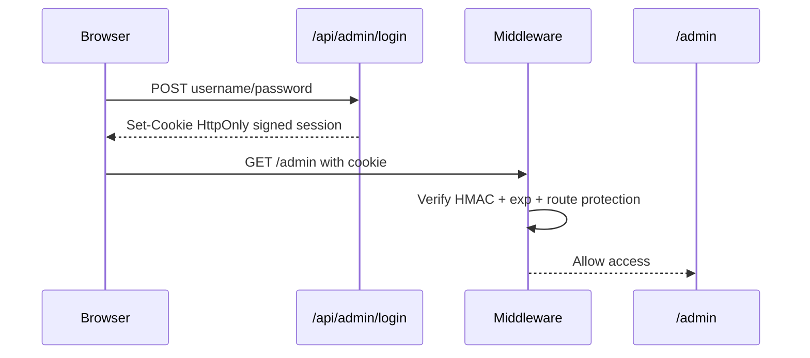

# Arquitectura NoteJob

## Resumen
NoteJob tiene 4 bloques principales:
1. App web (Astro + Bun + Sass + GSAP/anime.js).
2. Autenticación y sesión (Firebase Auth para usuarios + sesión admin server-side).
3. Capa de APIs internas (locale, admin auth, estado).
4. Persistencia cliente y futura persistencia servidor (vault local cifrado, personalización local, D1/Firebase como siguiente paso).

## Diagrama de componentes
```mermaid
flowchart LR
  U[User Browser] --> W[NoteJob Web App]
  W --> FA[Firebase Auth]
  W --> LAPI[/api/locale]
  W --> AIP[AI Provider API]
  W --> AL[/api/admin/login]
  W --> AS[/api/admin/session]
  W --> AO[/api/admin/logout]
  LAPI --> IPG[ip.guide]
  AL --> AC[Admin Credentials Env]
  AS --> AC
  AO --> AC
  W --> LS[(LocalStorage)]
  LS --> VC[Encrypted Vault]
  LS --> SC[Site Customization]
```

## Diagrama de flujos funcionales


## Seguridad (alto nivel)


## Decisiones clave
- Autenticación de usuario: Firebase Auth para signup/login y verificación de correo.
- Autenticación admin: cookie firmada server-side, no solo validación de frontend.
- Configuración sensible: variables de entorno + settings de usuario (cuando aplica).
- Vault: cifrado local AES-GCM para snippets sensibles con passphrase.
- UX: modo oscuro por defecto, interfaz de baja fatiga visual, navegación simple.

## Integración con Vercel + GitHub
- Source of truth: GitHub.
- Deploy: Vercel desde repositorio GitHub.
- Recomendación: PR + preview deploy + merge a main para producción.

## Próximos pasos de arquitectura
1. Persistir tareas/proyectos/recursos en D1 o Firebase Firestore.
2. Migrar vault opcional a backend cifrado con clave de usuario.
3. Agregar auditoría de acciones admin (quién cambió tema/copy/layout y cuándo).
